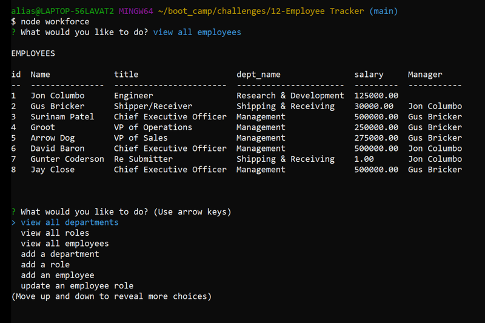

# Workforce
## An application by H0RSESH0E  
&nbsp;  
  
&nbsp;&nbsp;  
## Table of Contents
#### [Description](#description)  -  [Installation](#installation)  -  [Usage](#usage) - [License](#license) - [Contributing](#contributing) - [Tests](#tests) - [Questions](#questions)
&nbsp;  
## Description  
Workforce is a content management system (CMS) that allows management of a Mysql database from the command line.  By utilizing Node.js nothing more than Node.js and a couple of node packages, this applications simple interface gets straight into the substance of creating, reading and updating (deleting coming soon) a multi-tabular database.  
&nbsp;  
    
   
&nbsp;  
[Walkthrough Video](https://drive.google.com/file/d/1xLTrXp841GpudqlrOQ8RbDgcSpM5ohjL/view)  
&nbsp;  
## Installation
Simply clone the repository and run with 'npm start' or 'node workforce'.  
&nbsp;  
## Usage
No warantees or gaurantees are made for any purpose or use.  
&nbsp;  
## License  

**MIT License**  
A short and simple permissive license with conditions only requiring preservation of copyright and license notices. Licensed works, modifications, and larger works may be distributed under different terms and without source code.  
[View the full license here.](./LICENSE/license.txt)  
&nbsp;  
## Contributing
This project is not being maintained.  Please respect the intellectual property of Trilogy Education Services contained in this project and my contributions to it.  
&nbsp;  
## Tests
N/A  
&nbsp;  
## Questions
Questions or concerns about the project or how to contribute to its development can be emailed to: **dcpb777@gmail.com**  
&nbsp;  
&nbsp;  
  
  
**[Visit me on GitHub](https://github.com/H0RSESH0E)**  
